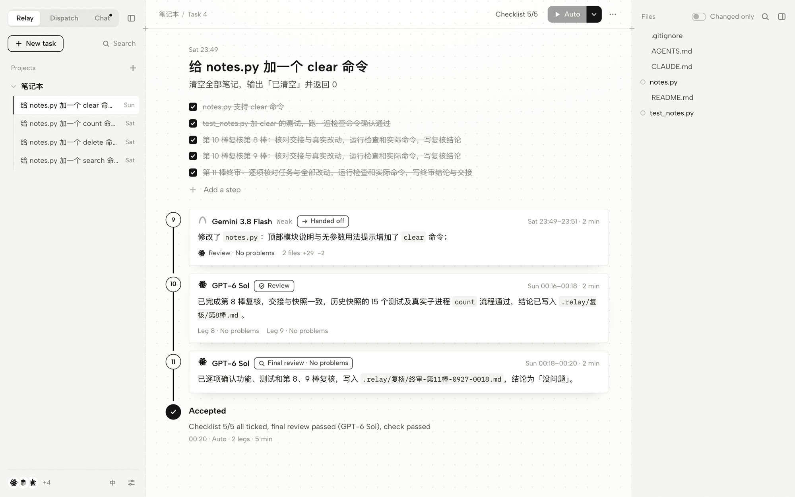

<div align="center">

# RelayDesk

**Quota runs out. The work doesn't.**

Line up Claude Code, Codex, Cursor, DeepSeek and the rest as one team, and let them finish the job in the same folder.<br>
Every leg is on record, and once a stronger model has quota again, it checks the lighter models' work first.

[](LICENSE)
[](https://nodejs.org)
[](#download)
[](https://github.com/zhousun55-byte/RelayDesk/actions)

[Download](#download) · [Get started](#get-started) · [中文](README.md)

</div>

<p align="center">
  <picture>
    <source media="(prefers-color-scheme: dark)" srcset="docs/images/hero-en-dark.png">
    
  </picture>
</p>

RelayDesk is the English name of 接力台 ("relay desk").

You probably have several AIs: Claude, Codex (GPT), Cursor, ZCode, MiMo, DeepSeek… each with its own quota. Claude runs out halfway through, so Codex continues in the same folder; Codex runs out too and only DeepSeek is left, which is cheap but noticeably weaker, and you worry it will break things.

RelayDesk lets these AIs **take turns in the same project folder**, and makes sure that:

- **Nothing is lost between turns.** Every AI starts by reading the relay book: the task, how far it got, what the last leg left behind, what is still open.
- **Every change is on the record.** Each leg's changed files and its own account of what it did are recorded. If a leg is cut off by quota before it writes a handoff, RelayDesk records it anyway.
- **Weak work gets reviewed.** Every leg done by a weak model is marked *needs review*. When a strong model has quota again, it first checks the real changes against the handoff, fixes what is wrong, writes a verdict, and only then continues.
- **Mistakes can be undone.** There are snapshots before and after every leg, so you can roll back to before any leg, and undo the rollback.
- **No babysitting.** Continue by hand in any AI tool (RelayDesk only keeps the books), or let RelayDesk dispatch: *Auto* keeps relaying until the work is accepted, switches to the next AI when one runs out, sends a strong model to review when its quota returns, and waits when nobody has quota.

<picture>
  <source media="(prefers-color-scheme: dark)" srcset="docs/images/relay-dark.png">
  
</picture>

The records in the screenshot were written by the AIs in Chinese; with English on, they write in English.

There is also a **group chat**: ask several AIs the same thing. *Compare* asks them at once without seeing each other; *Vote* collects anonymous proposals and one vote per AI, weak or strong, with no voting for yourself; *Summary* has one AI merge the answers, with names removed, into a conclusion, agreements, disagreements, advice and a next step. The adopted plan goes into the task's rules, and every later leg follows it.

> The web app is available in English and Chinese: click **EN / 中** at the bottom left (the first visit follows your browser language). Detailed documentation is in Chinese ([README.md](README.md), [docs/设计说明.md](docs/设计说明.md)). RelayDesk is used most on macOS. Windows 10 / 11 has a native version (double-click `install-windows.cmd`, no WSL needed), installed and used on a real machine. The CLI and web app also run on Linux.

## Download

| macOS | Windows 10 / 11 |
| :-- | :-- |
| [RelayDesk-mac.zip](../../releases/latest/download/RelayDesk-mac.zip) | [RelayDesk-windows.zip](../../releases/latest/download/RelayDesk-windows.zip) |
| Unzip, double-click `安装接力台（Mac）.command` | Unzip, double-click `install-windows.cmd` |

The packages are prebuilt: nothing is downloaded or compiled during install. You need [Node.js](https://nodejs.org) 20 or newer and git (on Windows the installer gets them with winget if they are missing). Each package has an `INSTALL.txt` with every step, including what to do when macOS or Windows blocks it. Older versions are under [Releases](../../releases). On Linux, or to work on the code, use git clone below.

## Get started

Requires [Node.js](https://nodejs.org) 20 or newer (20, 22 and 24 are tested) and git.

macOS, one command:

```bash
git clone https://github.com/zhousun55-byte/RelayDesk.git && cd RelayDesk && zsh scripts/make-desktop-app.sh
```

From a downloaded package: unzip it and double-click `安装接力台（Mac）.command` in Finder ("install RelayDesk"). If macOS says it can't verify the developer, click "Open Anyway" at the bottom of System Settings → Privacy & Security.

This installs dependencies, builds, puts a **RelayDesk** app (named 接力台) in `/Applications` (or `~/Applications` without write access) that starts in the background at login, and opens the web page. No Dock or desktop icon, no terminal window. Open it later from Launchpad or Spotlight, or at http://127.0.0.1:7388. To remove it: `zsh scripts/make-desktop-app.sh --remove`.

Windows 10 / 11: put the folder somewhere it will stay and double-click `install-windows.cmd`. It installs Node.js and Git with winget if they are missing, installs dependencies, builds, adds **接力台** (RelayDesk) to the Start menu, starts it in the background at login, and opens the web page. No console window, no desktop icon. To remove it: `install-windows.cmd --remove`.

Linux (or if you don't want it running in the background):

```bash
git clone https://github.com/zhousun55-byte/RelayDesk.git && cd RelayDesk && npm install && npm run build && npm start
```

`npm start` opens the web page; press Ctrl-C to stop. Run `npm link` once to get the `relay` command everywhere.

Then:

1. **Open RelayDesk.** The first time, it detects which AI tools are installed, which models they use and which model APIs you have configured (a few seconds). Members are named after their models.
2. **Connect a project.** Click **+** next to *Projects*, choose the project folder, and write what should be done. The first line is the task; each line starting with `- ` is a step.
3. **Continue**, either way:
   - **By hand:** open the folder in any AI tool and say "continue". It reads `.relay/接力本.md` first and follows the rules while writing a handoff.
   - **Let RelayDesk do it:** click **Auto** at the top (or turn on *Auto* under the input box before sending the task). To have one specific AI do one leg, use the ▾ next to it. With *Auto* off, sending only writes the task down.
4. **Watch, review, roll back** in the web app. Legs by weak models say *Needs review*.

### One tool, several models

A tool can usually switch models: Claude Code has Opus and Sonnet, Cursor has dozens. In *Settings → Members*, click a member's name: you see the model it uses and the newest few from the same family (type to search the rest, or type any model name). Click one to switch this member to it; the *+* on the right adds another member with that model, with its own name, strong/weak setting and quota. The list comes from the tool itself and costs nothing (Codex's model cache; the `models` command of Cursor, Antigravity, OpenCode and Grok; an API's model list; Claude Code's aliases fable / opus / sonnet / haiku). Effort and speed variants are merged, and speech or embedding models are left out. Nothing is added automatically.

A task written on the *Dispatch* page starts as soon as it is sent. On that page, the line under the input box (for example *GLM-5.3 hands to GLM-5.3 Flash*) sets who splits the task and does the final review, and who does the steps: by default strong models lead and weak models work, in list order. You can pick, for example, MiMo V2.6 Pro leading MiMo V2.6 Flash, GLM-5.3 leading GLM-5.3 Flash, or Opus leading Sonnet. If the crew member can't work this time, weak models take over in order. Strong and weak only decide reviews.

### What each tool keeps

Work sent to a coding tool (Claude Code, Codex, Cursor, Antigravity, DeepSeek Harness) runs in that tool's own CLI, so it keeps its own tools, subagents, skills, MCP servers, rules and memory. The Claude official-account member reads your user settings too; RelayDesk only overrides the few settings that point Claude Code at another provider. With permissions set to *project only*, MCP calls follow each tool's own approvals; with *unrestricted*, they are allowed (Cursor gets `--approve-mcps`). Group chat is read-only. API members use RelayDesk's small built-in agent and have no skills, MCP or subagents.

### Conversations in tools

Each leg records its conversation id in the tool (Claude Code, Codex, Cursor and Antigravity report one). On a leg, *Open in Claude* opens that conversation in the Claude desktop app; for Codex, Cursor and Antigravity, *Copy command* copies the command that continues it (`codex resume <id>` and so on). *Thread* shows the conversation inside RelayDesk, including anything you added later in the tool (Claude Code and Codex records are readable). On the Relay page, *Conversations in tools* lists the Claude Code and Codex conversations you started yourself in this project folder. In *Settings → Run*, *Continue the same conversation* (off by default) makes a member's next leg in a task continue its previous conversation, and *List conversations in tools* (on) can turn the list off. Only folders connected to RelayDesk are read, only when you look, and nothing is stored or sent anywhere.

## Where things live

- `.relay/` in your project: the ledger, the relay book, handoffs, reviews, snapshots (a separate git directory, so your own git history is untouched), uploads.
- `AGENTS.md` / `CLAUDE.md` in your project: a short *relay rules* section between two markers, so any AI tool knows how to take part.
- `~/.relay/`: the member list, run settings and quota records, shared by all projects.

## Language

The web app switches between English and Chinese with one click. With English on, RelayDesk also asks every AI to write handoffs, reviews and replies in English. The relay rules, the relay book headings and the files inside `.relay/` stay in Chinese for now, because RelayDesk reads those headings.

## Development

```bash
npm test                  # build + all tests (no network, no cost)
python3 scripts/e2e.py    # real browser clicks (needs playwright)
```

Tests use fake `claude` / `codex` / `dsh` programs with the real argument and output formats, and a fake model API. Passing them is not the same as accepting a real tool. See [CONTRIBUTING.md](CONTRIBUTING.md) to add a new AI tool.

## License

[MIT](LICENSE)
