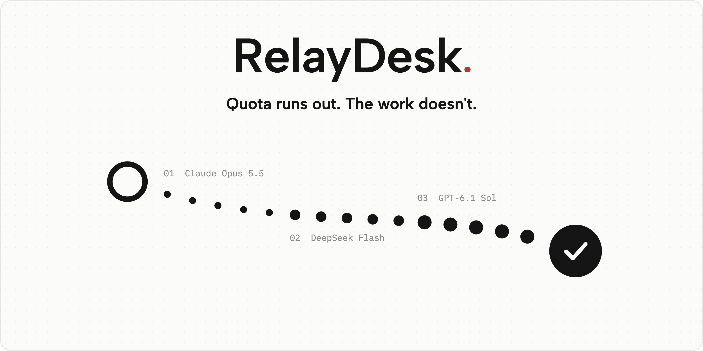
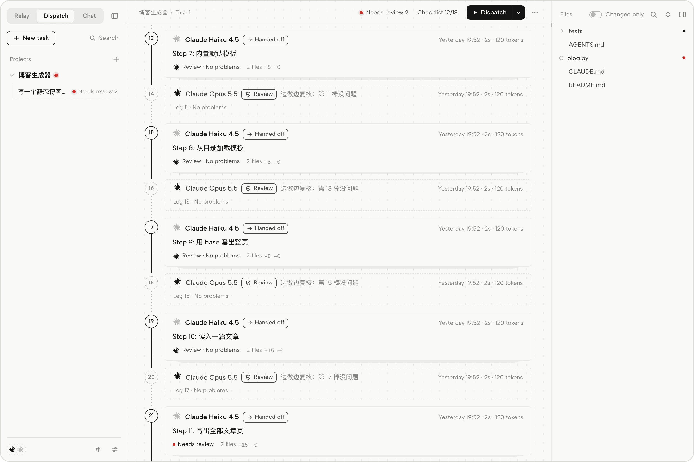
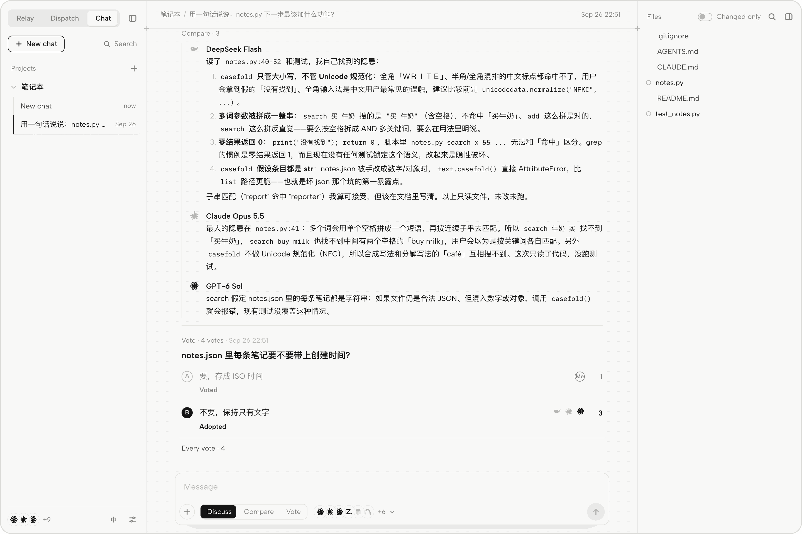

<p align="center">
  <picture>
    <source media="(prefers-color-scheme: dark)" srcset="docs/images/hero-en-dark.png">
    
  </picture>
</p>

<p align="center">
  Let Claude Code, Codex, Cursor and DeepSeek work on the same folder together.<br>
  When one runs out of quota the next takes over, a strong model hands small steps to a faster one, and when you're unsure, they vote.
</p>

<p align="center">
  <a href="https://github.com/zhousun55-byte/RelayDesk/releases/latest/download/RelayDesk-mac.zip"><b>Download for macOS</b></a>
  &nbsp;·&nbsp;
  <a href="https://github.com/zhousun55-byte/RelayDesk/releases/latest/download/RelayDesk-windows.zip"><b>Download for Windows</b></a>
  &nbsp;·&nbsp;
  <a href="docs/manual.md">Guide</a>
  &nbsp;·&nbsp;
  <a href="README.md">中文</a>
</p>

<br>

## Relay

Claude runs out of quota halfway through. Codex picks it up and runs out too. DeepSeek still has plenty, but you don't trust it alone with that much code.

RelayDesk lets these AIs take turns in the same folder. Every leg starts by reading the relay book and ends with a handoff, so nobody has to re-explain. When one runs out of quota the next takes over; when all are out, it waits for the first to come back. Legs done by lighter models are marked *needs review* until a stronger model checks the real changes. There is a snapshot before and after every leg, so you can roll back to before any leg, and undo the rollback.

<picture>
  <source media="(prefers-color-scheme: dark)" srcset="docs/images/ui-en-dark.png">
  
</picture>

## Dispatch

For a job too big for one leg, pair a strong model with a faster one from the same tool. The strong model reads the code and splits the task into small steps, the faster model does one step per leg, and the strong model reviews alongside without touching files. In Claude Code that is Opus splitting and Haiku doing; GLM-5.3 handing to GLM-5.3 Flash or MiMo V2.6 Pro handing to MiMo V2.6 Flash works the same way. If the faster model gets stuck on a step, that step goes back to the strong model.

<picture>
  <source media="(prefers-color-scheme: dark)" srcset="docs/images/dispatch-en-dark.png">
  
</picture>

## Group chat

When you're not sure, ask several AIs at once. In *Compare* they answer at the same time without seeing each other. In *Vote* the proposals are anonymous, each AI gets one vote and can't vote for itself, so a lighter model's vote counts too. One of them can also merge the answers into a conclusion that keeps the disagreements. The adopted plan goes into the task's rules, and every later leg follows it.

<picture>
  <source media="(prefers-color-scheme: dark)" srcset="docs/images/chat-en-dark.png">
  
</picture>

## Install

1. Install [Node.js](https://nodejs.org) 20 or newer and git. On Windows the installer gets them with winget if they are missing.
2. Download the package for your system above, unzip it, and put the folder somewhere it will stay.
3. On a Mac, double-click `安装接力台（Mac）.command` ("install RelayDesk"). On Windows, double-click `install-windows.cmd`.

The web app opens when it is done. Open it later from Launchpad or the Start menu; it runs in the background with no icon. If macOS or Windows blocks it, see `INSTALL.txt` in the package.

On Linux, or to run from source:

```bash
git clone https://github.com/zhousun55-byte/RelayDesk.git && cd RelayDesk
npm install && npm run build && npm start
```

## Use it

1. Click **+** next to *Projects* and choose a project folder.
2. Pick a page at the top left (Relay, Dispatch or Chat), write what should be done and press Enter.
3. On the Relay page, click **Auto**. RelayDesk hands out legs until the work is accepted. Or open the folder in any AI tool and say "continue".

The web app switches between English and Chinese with **EN / 中** at the bottom left. With English on, the AIs write their handoffs and reviews in English.

## Works with

Claude Code, Codex, Cursor, ZCode, DeepSeek Harness, Antigravity, Gemini CLI, Qwen Code, OpenCode, and OpenAI-compatible APIs such as DeepSeek, Kimi, Zhipu and MiMo. Work runs in each tool's own CLI, with its own skills, MCP servers and rules.

## Good to know

1. RelayDesk runs on your machine. It writes only `.relay/` in your project and a marked section at the end of `AGENTS.md` and `CLAUDE.md`. Snapshots live in their own repository and never touch your git.
2. Dispatch does not save tokens. On tasks that take ten minutes or so, it spends 3 to 7 times the strong-model tokens of doing it directly. It is meant for jobs too big for one leg.
3. Used most on macOS. Windows has been installed and used on a real machine. Linux has only been through the automated tests.

More in the [guide](docs/manual.md). The full manual is in Chinese: [使用手册](docs/使用手册.md).

## Thanks

Reading tool transcripts follows [mindbus](https://github.com/BaoWeiiii/mindbus). Failure classification and backing off after errors follow [magpie](https://github.com/yetone/magpie). Checking Codex quota without spending it follows [CodexBar](https://github.com/steipete/CodexBar).

[MIT](LICENSE) © ZHOUSUN
