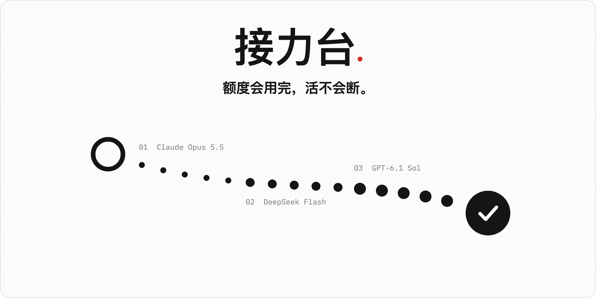
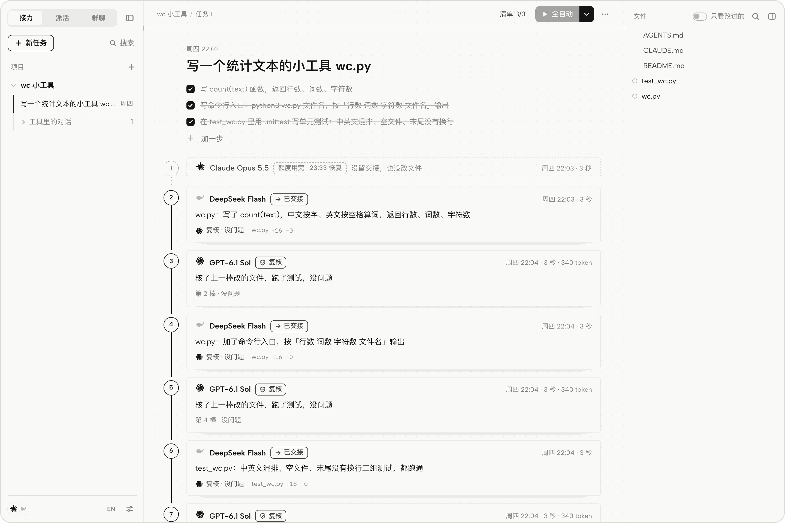

<p align="center">
  <picture>
    <source media="(prefers-color-scheme: dark)" srcset="docs/images/hero-dark.png">
    
  </picture>
</p>

<p align="center">
  让 Claude Code、Codex、Cursor、DeepSeek 在同一个文件夹里接力写代码。<br>
  一个没额度了，下一个接上；弱一档的模型做完，强的那位核过再往下走。
</p>

<p align="center">
  <a href="https://github.com/zhousun55-byte/RelayDesk/releases/latest/download/RelayDesk-mac.zip"><b>下载 macOS 版</b></a>
  &nbsp;·&nbsp;
  <a href="https://github.com/zhousun55-byte/RelayDesk/releases/latest/download/RelayDesk-windows.zip"><b>下载 Windows 版</b></a>
  &nbsp;·&nbsp;
  <a href="docs/使用手册.md">使用手册</a>
  &nbsp;·&nbsp;
  <a href="README.en.md">English</a>
</p>

<br>

<picture>
  <source media="(prefers-color-scheme: dark)" srcset="docs/images/ui-dark.png">
  
</picture>

## 为什么做它

写到一半，Claude 额度用完了。换 Codex 接着写，又用完了。只剩 DeepSeek，额度够，可不放心让它一个人改这么多代码。

接力台把手上这几个 AI 排成一队，在同一个文件夹里轮流接着做。

## 它做的事

1. 接力。每一棒开工先读接力本，收工写交接，换人不用重讲一遍。额度用完就换下一位，都没额度就等最早恢复的那位。
2. 复核。弱一档的模型做完的棒标成「待复核」，强模型对照真实改动核过才算数。
3. 退回。每一棒前后都存快照，能退回到任意一棒之前，退错了还能撤销。
4. 派活。同一个工具里，强模型把任务拆成小步，同一家更快的模型一步一步做。
5. 群聊。拿不准时问几个 AI，匿名投票，一个 AI 一票，不能投自己。

## 装上

1. 先装好 [Node.js](https://nodejs.org) 20 或更新的版本和 git。Windows 上没有的话，安装程序会用 winget 装。
2. 下载上面对应系统的包，解压，把文件夹放在以后不挪动的地方。
3. Mac 双击「安装接力台（Mac）.command」，Windows 双击 `install-windows.cmd`。

装好后浏览器会打开接力台，以后从启动台或开始菜单打开。它在后台运行，不挂图标。被系统拦下时怎么办，写在包里的 `INSTALL.txt`。

Linux，或者想从源码跑：

```bash
git clone https://github.com/zhousun55-byte/RelayDesk.git && cd RelayDesk
npm install && npm run build && npm start
```

## 用起来

1. 点左边「项目」旁的 +，选一个项目文件夹。
2. 在中间写一句要做什么，回车。
3. 点顶上的「全自动」，接力台一棒一棒派下去，做到验收通过。也可以在任何 AI 工具里打开这个文件夹，说一句「接着做」。

## 能接进来的

Claude Code、Codex、Cursor、ZCode、DeepSeek Harness、Antigravity、Gemini CLI、Qwen Code、OpenCode，以及 DeepSeek、Kimi、智谱、MiMo 这类 OpenAI 兼容接口。派出去的活跑在各家自己的命令行里，技能、MCP 和规则照常用。

## 先说清楚

1. 接力台在本机运行，只写项目里的 `.relay/`，和 `AGENTS.md`、`CLAUDE.md` 末尾带标记的一小段。快照存在它自己的仓库里，不碰你的 git。
2. 派活不省钱。十来分钟能做完的小任务，派活花的强模型 token 是直接做的 3 到 7 倍，它是给一棒做不完的大任务准备的。
3. macOS 上用得最多，Windows 在一台真机上装好用过，Linux 只跑过自动测试。

网页怎么用、强弱怎么判断、对话同步、全自动和派活、命令行、安全、常见问题，都在[使用手册](docs/使用手册.md)里。

## 致谢

对话记录的读法学了 [mindbus](https://github.com/BaoWeiiii/mindbus)，失败分类和出错后往后排学了 [magpie](https://github.com/yetone/magpie)，不花额度查 Codex 额度学了 [CodexBar](https://github.com/steipete/CodexBar)。

[MIT](LICENSE) © ZHOUSUN
