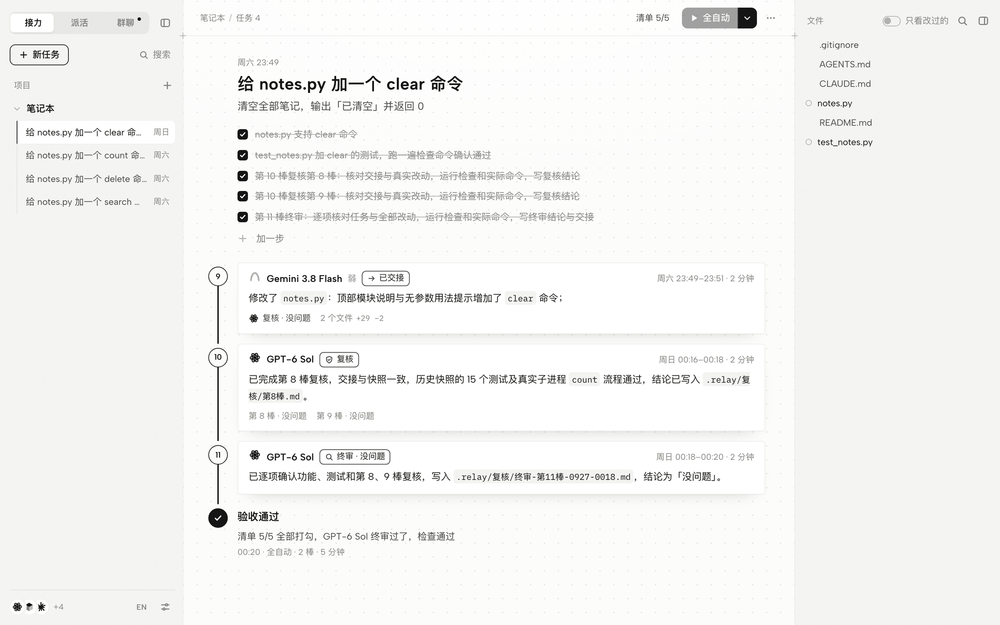
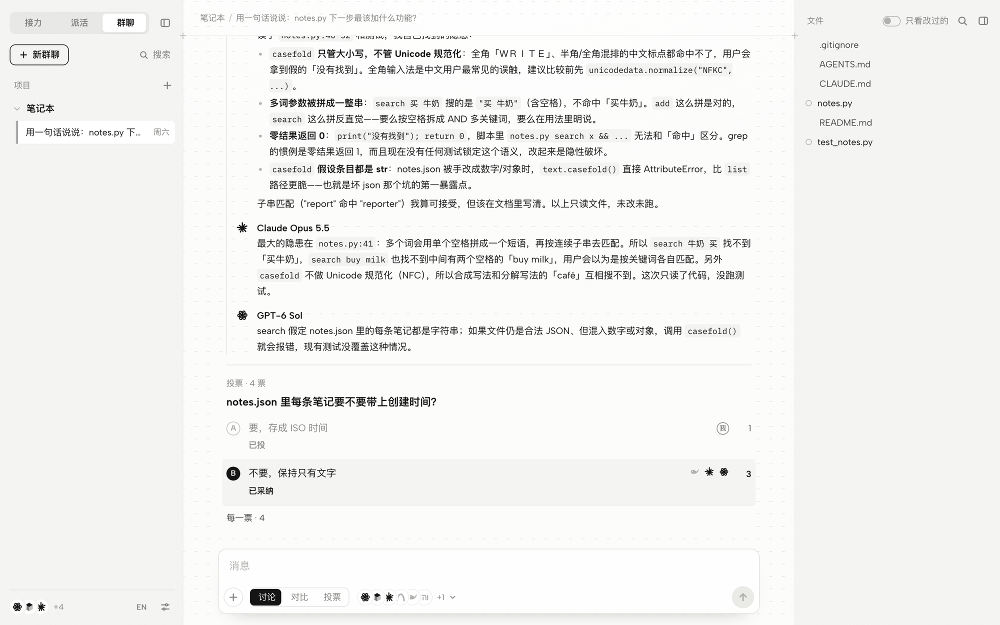

# 接力台（RelayDesk）

**额度用完，换谁接着做都不怕。**

你手上可能有好几个 AI：Claude、Codex（GPT）、Cursor、ZCode、MiMo、DeepSeek……每个都有额度。
用 Claude 做到一半额度没了，换 Codex 在同一个文件夹里接着做；Codex 也没了，只剩 DeepSeek——便宜，但明显弱一些，怕它把代码改坏。

接力台让这些 AI **在同一个项目文件夹里轮流接着做**，并且保证：

- **接得上**：谁一开工都先读「接力本」：任务是什么、做到哪了、上一棒留了什么话、哪里还没做完。
- **有账可查**：每一棒改了哪些文件、它自己说做了什么，都记下来。额度用完被打断、没来得及留话的，接力台替它记一笔。
- **有人把关**：弱模型（比如 DeepSeek）做的每一棒都标「待复核」。强模型额度恢复后，先对照它的交接把真实改动核一遍——说做了的是不是真做了、有没有改错——错的直接修好，写下复核结论，再接着往下做。
- **改坏了能退回**：每一棒前后都有快照，可以退回到任何一棒之前，退错了还能撤销。
- **不用来回点**：可以自己在各家 AI 工具里接着做（接力台只管记账和提醒）；也可以让接力台替你调度，**全自动**一直接力到做完：额度用完自动换下一位，强模型额度恢复后自动去复核，都没额度了就等。

另外还有**群聊**：把几个 AI 拉进一个群，对同一件事各出主意。「对比」时几个 AI 同时回答、互相看不到，弱模型不会跟着强模型的思路走；**投票**时方案匿名、一个 AI 一票不分强弱、不能投自己，弱模型的好想法也不会被埋没。定下来的方案写进任务的「约定」，之后接力的每一棒都会遵守。

<picture>
  <source media="(prefers-color-scheme: dark)" srcset="docs/images/relay-dark.png">
  
</picture>

> 网页有中文和英文，左下角一键切换（第一次打开按浏览器的语言）；文档是中文的，英文简介见 [README.en.md](README.en.md)。macOS 上用得最多；Windows 10 / 11 上有原生版（双击 `install-windows.cmd` 装好，不用 WSL），在真机上装好用过；Linux 上命令行和网页都能用。

## 三分钟上手

需要 [Node.js](https://nodejs.org) 20 或更新的版本（20、22、24 都测过）和 git。

macOS 上一条命令装好：

```bash
git clone <这个仓库的地址> agent-relay && cd agent-relay && zsh scripts/make-desktop-app.sh
```

下载的压缩包：解压后在访达里双击「安装接力台（Mac）.command」，效果一样（系统说无法验证开发者时，到「系统设置 → 隐私与安全性」最下面点「仍要打开」）。在终端里输入命令时，`scripts/make-desktop-app.sh` 前面要带上文件夹的完整位置（把文件拖进终端窗口会自动填好），只打 `/scripts/…` 会报找不到文件。

它会装好依赖、编译好，在「应用程序」文件夹（`/Applications`，没有写权限时放 `~/Applications`）里放一个「接力台」并让它登录电脑时自己在后台启动，最后打开网页。桌面和程序坞上都不挂图标，也不弹终端窗口。接力台意外退出、或者编译出了新版本，它几秒内在后台重新拉起（手上有活时等活干完），开着的网页会自己刷新成新版。以后要打开网页，在启动台或聚焦搜索（⌘ 空格）里打开「接力台」，或者在浏览器里打开 http://127.0.0.1:7388 。在网页「设置」里点「关闭接力台」，它就停下，直到你下次打开「接力台」或重新登录。不想要了：`zsh scripts/make-desktop-app.sh --remove`。

Windows 10 / 11：把文件夹放在一个以后不挪动的地方，双击里面的 `install-windows.cmd`。没有 Node.js、Git 的，它用系统自带的 winget 装；然后装依赖、编译，在开始菜单里放一个「接力台」，登录电脑时在后台启动，最后打开网页。以后从开始菜单打开，不弹黑窗口，桌面上不放图标；意外退出、编译出新版本，一样几秒内在后台重新拉起。不想要了：在这个文件夹里执行 `install-windows.cmd --remove`。

Linux（或者不想让它在后台常驻）：

```bash
git clone <这个仓库的地址> agent-relay && cd agent-relay && npm install && npm run build && npm start
```

`npm start` 会打开网页，按 Ctrl-C 停下（Windows 上也能这样用：在 PowerShell 里一条一条执行）。想在终端里到处用 `relay` 命令，再执行一次 `npm link`。

然后：

1. **打开接力台**：在启动台或聚焦搜索里打开「接力台」，或者在终端执行 `relay`。第一次打开时，它会自动找出这台电脑上装了哪些 AI 工具、各自用什么模型、配了哪些模型接口（十几秒），同一家的桌面程序和命令行并成一位，一律叫模型的名字。密钥存在别的工具配置里的（比如 MiMo），在「设置 → 成员」里点「同意使用」才用。
2. **接入你的项目**：点网页左边「项目」旁的 +，选项目文件夹，在中间的输入框里写一句要做什么，回车。第一行是任务，下面用「- 」开头的每一行是一步。
3. **接着做**，两种方式随便用：
   - **自己来**：在任何 AI 工具里打开这个文件夹，对它说「接着做」。它会先读 `.relay/接力本.md`，照着规矩干活、边做边写交接。
   - **让接力台来**：点顶上的「全自动」，换谁接着做都行，做到验收通过为止；只想让某一位做一棒，点旁边的 ▾ 选人。
4. **看进度、复核、退回**：都在接力台的网页上。弱模型做的棒标着「待复核」，点顶上的「待复核」再点「复核」，或者展开那一棒点「复核」。

### 网页

- **三页**：左上角「接力 / 派活 / 群聊」切换，同一个网页，不开新窗口。「接力」是任务和一棒一棒的线路；「派活」是强模型拆成小步、弱模型一步步做；「群聊」是讨论和投票。
- **中文 / 英文**：左下角设置旁边的「EN」（英文界面上是「中」）点一下就换，正在看的对话、打开的文件、输入框里的字都留着；「设置 → 通用 → 语言」也能换。换成英文后，接力台派活时也请 AI 用英文写交接、复核和回答。
- **屏幕多大都能用**：手机、竖着的平板上两边的栏是抽屉；窗口窄得放不下三栏时右边的文件栏自己收起，拉宽了自己回来；大屏上对话跟着放宽。
- **左边**：项目，下面是这个项目的任务（接力）或几段群聊（群聊）。「新任务」「新群聊」开一段新的，旧的留在下面随时翻；存下的群聊点开接着说，它就换回正在用的那一段。左下角是成员，只露三位，点开是全部（模型、在哪个工具里跑、在干活还是额度用完、强弱）。还没打开过项目时，中间只有「打开文件夹」。
- **中间**：一个任务是一条线路。最上面是任务标题和清单（点方框打勾，最后一行直接写下一步）；每一棒是线路上的一站，编号写在小圆圈里，一张小条写着谁做的、什么状态（已交接、已停止……）、一句话做了什么，底下一行淡字只写要注意的（待复核、出错、谁复核的、改了几个文件）。被叫停、没留交接的那一段是一串点。点开一棒是交接单：做了、没做完、拿不准、验证、改了哪些文件。线路的终点是验收（通过、没过、没法判断），点开看还差什么。群聊那一页是你问的话、AI 的回答、投票。
- **右边**：项目文件。鼠标停在一棒上，会有一串点从它连到它改过的文件；停在文件上，改过它的那几棒描出来，也各连一串点过去；输入框里带上的文件停一下，连到文件树里那一行。文件可以点开看、看某一棒对它的改动，也可以拖进输入框；右上角一键全部展开 / 全部收起。检查命令和最近一次的结果在「设置 → 项目」里，验收没过时点开验收也能看到。
- **输入框**：接力那一页用来写新任务；群聊那一页选「讨论 / 对比 / 投票」，谁来回答叠成一叠，点开勾选。打 `/` 出命令（加一步、接着做、全自动、复核……），打 `@` 选成员或文件（AI 和文件分成两组）。左边的 + 传文件和图片（也能直接粘贴截图、从访达或资源管理器拖进来），存在项目的 `.relay/uploads` 里（不进快照，也不进你的 git），AI 按路径打开看。粘进来很长一段字（超过 2000 字或 40 行，比如日志、需求文档）会存成一个文字文件带上，输入框里只占一个小条，点开在页签里看；群聊里很长的话和很长的回答都先收起，点「展开」看全文。`⌘K`（Windows、Linux 上是 `Ctrl+K`）搜任务、群聊、项目、文件和操作。
- **右键**：左边的对话、群聊、项目，中间的每一棒、清单的每一步、群聊的每句话、页签、空白处，右边的文件、设置里的成员，右键都有菜单，放的是这个东西常用的操作（打开、全自动、复核、退回、复制、引用、删除……）。删除对话只是左边不再列出，里面的棒也不再算待复核（项目的红点、「第 N 棒待复核」跟着消失），每一棒的记录、交接、快照都留着；删的是正在做的任务，任务清单也清空，回到写新任务的样子；删除群聊是挪进 `.relay/已删除的群聊/`。删完提示里都能撤销；全自动还在跑、有一棒还没交接时删不了任务，还有 AI 在说的群聊删不了。选中了字、点在输入框和链接上时，还是浏览器自己的菜单。
- **成员**：一律叫它用的模型（GPT-6 Sol、Claude Opus 5.5、Grok 4.7），底下一行写在哪个工具里跑。同一家的桌面程序记在它名下（ChatGPT 记在 GPT-6 Sol 名下，▾ 里的「打开」用它），同一个工具、同一个模型的只留一位；同一个工具要用别的模型，在「添加 → 模型」里勾（见下面「同一个工具，几个模型」）。每一位后面有删除，删掉的重新识别也不会再加回来。接力台没画过图标的模型（比如你加的 Mistral、豆包），图标是它名字的头一个字母。

黑白灰，外加一颗小红点：只有要你管的地方（待复核、验收没过、出错）前面有一个。全站一种字（Albert Sans 配苹方），代码用等宽字；字体打包在接力台里（`src/web/fonts/`），不从网上下载。跟随系统的浅色 / 深色，也可以在「设置 → 通用」里固定。

## 它是怎么做到的

接入一个文件夹时，接力台会：

- 建一个 `.relay/` 文件夹（隐藏的，AI 工具搜代码时默认不会翻进去）；
- 在 `AGENTS.md` 和 `CLAUDE.md` 末尾加一段「接力规矩」——Codex、Cursor、ZCode、MiMo、OpenCode 开工时会读 `AGENTS.md`，Claude Code 会读 `CLAUDE.md`。你自己写在这两个文件里的内容不动，规矩那一段前后有标记，随时可以删；
- 存第一张快照。

规矩很短，大意是：

1. 开工先读 `.relay/接力本.md`；
2. 一开工就在 `.relay/交接/` 建你的交接文件，边做边记（额度随时可能用完）；
3. 接力本里有「待复核」、而你是强模型，建好交接文件就先复核；复核结论只写五种之一：没问题 / 有问题，已修好 / 改坏了，已退回 / 有问题，还没修 / 证据不足；
4. 做完一步就在 `.relay/任务.md` 里打勾；
5. 收工前把交接写完整。

接力台开着的时候，会在后台盯着文件夹：

| 看到什么 | 做什么 |
|---|---|
| 文件有变化 | 存一张快照；没人在做就开一棒，先记成「不知道是谁」 |
| 出现新的交接 | 认出是谁（看模型定强弱），这一棒记到它名下 |
| 交接写了「已交接 / 全部完成 / 卡住了」 | 这一棒结束：算出改了哪些文件、跑一遍检查命令（有的话）。检查命令自己写的缓存、报告（`.pytest_cache`、`coverage.xml` 这类）算接力台的改动，不算到哪一棒头上 |
| 一段改动之后 20 分钟没动静、又没交接 | 当它被打断了，替它记一笔（要复核） |
| 弱模型、不知道是谁、没留交接的棒 | 盖「待核」章，把真实改动准备成 `.relay/复核/第N棒.diff`。弱模型一个文件没改、只在清单里打了勾，也要复核（确认那几步真做完了） |
| 复核结论写好了 | 先看是谁写的：按复核文件改动的时间对是哪一棒——没有哪一棒在做的时候写的认不出是谁，不算数；文件里写的复核人是弱模型也不算。再看「结论」那一行：强模型写的「没问题 / 有问题，已修好 / 改坏了，已退回」才盖「已核」；写「有问题，还没修」「证据不足」、或者没写清楚，还是待复核。后来有人改了强模型写的复核，强模型原来的结论还在 |
| 读不出改动（快照仓库出错）、配置文件坏了、账本有读不出来的行 | 直接说出来：读不出改动的棒按要复核算，配置坏了网页顶上会提示、全自动不开工，账本坏了验收说「没法验收」并写明第几行——不会当成「没改文件」「没配检查」 |

### 强和弱

看的是**模型**，不是工具：Claude Code 接的是 DeepSeek，它就算弱。默认按模型名猜——Claude（Opus / Sonnet / Fable）、GPT-5 及以上、o3 / o4、Gemini Pro 或 3 及以上、Grok 4 及以上算强，其他算弱；桌面程序看不出模型，就借同一家命令行或接口的模型来判断；自动识别到、又看不出用的哪个模型的工具，按弱算。Cursor 用你在 Cursor 里选的模型（桌面版对话框里选的，换成命令行认的名字）。在「设置」里可以逐个改，改过的以你为准。

**同一个 Claude Code 可能是两位。** 很多人在 `~/.claude/settings.json` 里把 Claude Code 接到了 DeepSeek、Kimi、智谱这类便宜的模型，同时手上还有 Claude 官方账号。接力台会把它们当成两位成员：

- 「Claude Code」：接的别家模型（比如 DeepSeek），多半算弱；
- 「Claude Code 官方账号」：claude.ai 登录的，默认用最新的 Opus，算强。接力台派它时会跳过你的用户设置（`--setting-sources project,local`）、去掉 `ANTHROPIC_*` 这些变量，让它走官方账号，额度和 Claude 桌面版是同一份。
  - 装了 Claude 桌面版的话，接力台用**桌面版自带的那份 Claude Code**（在 `~/Library/Application Support/Claude/claude-code/` 里，跟着桌面版更新，通常比终端里的新，能用上最新的 Opus）。终端里的 `claude` 一点不动；接力台调用 Claude Code 时也会关掉它的自动更新，升不升级由你定。
  - 「最新的 Opus」按这台电脑上最近用过的来定（和桌面版一样）。命令行里的简称 `opus` 不一定是最新版，所以接力台会写全名。
  - 用的那份 Claude Code 太旧、用不了这个模型时，接力台会当场换成 `opus` 接着干，这一棒不算失败，并记下来；名单上会标出来。桌面版更新（或者你自己在终端升级）之后，会自动换回最新的。

**同一个工具，几个模型。** 一个工具往往能换好几个模型：Claude Code 有 Opus、Sonnet，Cursor 里有几十个。在「设置 → 成员」点「添加 → 模型」（或者在成员上右键「添加模型」），选工具、勾上要用的模型，每个模型就是单独的一位：名字、强弱、额度各算各的，接力、派活、群聊里和别的成员一样用。列表是工具自己报的，不花额度（Codex 的模型缓存；Cursor、Antigravity、OpenCode、Grok 的 `models` 命令；接口的模型列表；Claude Code 是它认的简称 fable / opus / sonnet / haiku，名字按这台电脑上最近实际用过的写）。同一个模型的几档（思考强度、快慢）并成一项，语音、向量这类不是对话用的模型不列；列不出来的工具可以直接写模型名。一个都不会自动加，用哪些由你挑。比如：

- Opus 做到一半、Sonnet 接着做：两位都在名单里，▾ 里挑 Sonnet 做下一棒；全自动按名单的顺序，Opus 的额度用完就轮到下一位。
- Opus 指挥 Sonnet：把 Sonnet 设成「弱」、Opus 拖到强模型的最前面，在「派活」页写任务。Opus 拆成小步、最后终审，Sonnet 一棒做一步。
- 两位一起讨论：群聊里把两位都勾上。

**到底是哪个 Claude 干的，以记录为准。** Claude Code 自己的会话记录（`~/.claude/projects/`）里记着每条回复实际用的是哪个模型。接力台拿它核对三件事：交接是哪个模型写的、复核结论是哪个模型写的、这段时间谁改了项目文件。所以接了 DeepSeek 的 Claude Code 在交接里自称 Opus，照样按弱的算；它写的复核（包括给自己写的）不算数，还要强模型再核。

### 快照和退回

快照存在项目里的 `.relay/snapshots`，是接力台自己的一个 git 仓库，**不碰你自己的 git**：不提交、不改暂存区、不切分支，你的 `.gitignore` 照样生效，`node_modules` 这类大目录和超过 20 MB 的文件不收。项目不是 git 仓库也没关系。

「退回到第 N 棒之前」会把整个文件夹恢复成那时的样子（改过的改回去、删掉的找回来、后来新加的删掉），之后的棒标成作废；任务清单也跟着退——按第 N 棒开始前的清单改回打勾，作废的那几棒打的勾去掉（标题、约定这些字不动）。作废的棒写过的复核也不再算数。退回前会先存一张，所以退回也能撤销（清单的勾也回来）。

### 让接力台调度

接力台用各家工具的无人值守模式在项目文件夹里干一棒：

| 工具 | 怎么调 | 权限「只在项目里」时 |
|---|---|---|
| Claude Code | `claude -p --output-format stream-json` | 自动接受改文件；命令在它自己的沙箱里跑 |
| Codex | `codex exec --json` | `workspace-write`：只能写项目文件夹 |
| Cursor Agent | `cursor-agent -p --output-format stream-json` | `--sandbox enabled` |
| ZCode | 桌面版自带的命令行内核 | `--mode edit` |
| DeepSeek Harness | 桌面版自带的 `dsh --profile headless --json`（没装 `dsh` 命令也行），用桌面版登录的账号和选的模型 | `workspace-write`：只能写项目文件夹，要审批的操作一律拒绝 |
| 只有接口的模型（DeepSeek、Kimi、通义、智谱、MiMo……任何 OpenAI 兼容接口） | 接力台内置的小代理：只能列文件、读文件、写文件、精确替换、搜索、跑检查命令 | 不能跑任意命令；按真实路径判断，经过链接指到项目外面的不能碰，`.git`、`.relay`、不许改的文件换个大小写也拦得住 |
| Antigravity | `agy -p --output-format stream-json`（1.1.12 以上） | 自动接受改文件；命令在它自己的沙箱里跑（只能写项目文件夹、不能联网），出沙箱、写项目外一律拒绝。它的「工具执行」是 proceed-in-sandbox 时沙箱里的命令都能跑，不然只跑放行过的；它设置里允许读写项目外的文件时安全档不派它（写文件的工具不经过沙箱） |
| Gemini CLI、Qwen Code、OpenCode、Droid、Copilot CLI、Grok CLI | 各自的非交互参数 | OpenCode、Copilot CLI 要权限「不限制」才能用 |

权限设成「不限制」（「设置 → 运行」里改）让工具不再拦任何操作，能装依赖、能联网、能改项目以外的文件，风险自负。

**全自动**一直接力到任务清单全部打勾：

- 额度用完（认得 Claude、Codex、Cursor、DeepSeek、智谱等的提示），记下什么时候恢复，换下一位；
- 有待复核、又有强模型能用，先派强模型复核；
- 全都没额度了，就等最早恢复的那一位（也可以设成不等、停下来交给你）；
- 清单全部打勾后，请强模型把整件事从头到尾过一遍（终审）；
- **只有验收通过才算完成**：弱模型的每一棒都有强模型复核通过，终审交接成功、实际是强模型、结论是「没问题」或「有问题，已修好」、终审之后没人再改文件，配了检查命令的话最后一次改动之后检查通过。差哪一样就停下来，告诉你差什么（复核两次还没过、终审两次都没过也停下）；
- 开工前会看：有 AI 正在别的工具里改这个文件夹（几分钟内还有改动），先问你它停了没有，确认了才换人，免得两个 AI 同时改文件；
- 一个项目同一时间只有一个调度（网页和命令行各点一次也不会跑出两个）。

网页上每个任务的线路终点就是验收：「验收通过」（实心圆圈）、「验收没过」「没法验收」（配置坏了或改动读不到），点开看还差什么。

**派活**（网页左上角「接力 / 派活 / 群聊」的中间那一页；命令行 `relay task --dispatch "要做什么"` 或 `relay auto --dispatch`）：让强模型动脑、弱模型动手，省强模型的额度，用掉弱模型花不完的额度。派活页只列在这一页写的任务，主按钮叫「派活」；每一棒写着工具自己报的 token 用量，收尾那一行写强模型、弱模型各用了多少。

- 开工前请一位强模型拆解：读代码，把清单改写成弱模型一棒做得完的小步，每步下面写几行要点：改哪些文件、要有哪些函数、怎么验证（网页上没做的步骤下面用小字显示）。它只写清单，不写代码，也不写逐字的期望输出和测试用例；
- 干活只派弱模型，一棒只做清单里的下一步；照写的做不通就写「卡住了」，不自己换做法；
- 中途不复核：弱模型做完整张清单后，终审的强模型一起复核所有弱模型的棒，只写一份结论（接力台记到每一棒上），发现问题直接改好（实测每次复核都接近让强模型直接做一遍，中途复核最费强模型）；
- 弱模型都没额度、都出错时不换强模型干活：开着「等额度恢复」就等最早恢复的那一位，等的时候可以叫停；不等就停下，写明每位弱模型怎么了。停下以后可以在 ▾ 里挑一位弱模型只做一棒（它也只拿到下一步），或者再点全自动；
- 终审、检查、验收和平常一样。适合强模型一棒做不完的大任务：实测两个强模型十来分钟能做完的任务（记账工具、静态博客生成器），派活花的强模型 token 是直接做的 3–7 倍，拆解和终审都要把整件事过一遍。

### 群聊和投票

<picture>
  <source media="(prefers-color-scheme: dark)" srcset="docs/images/chat-dark.png">
  
</picture>

- **讨论**：一个接一个说，后面的看得到前面的。
- **对比**：同时问，互相看不到——各自独立的判断，并排放在一起对比。
- **投票**：选项你来列（列两个以上就直接投；只列一个，AI 先各出一个方案，你的那个一起参加），或者请每个 AI 先各出一个方案；方案打乱顺序、去掉名字发给大家投票，一个 AI 一票，不能投自己，要写理由；投完才揭晓每个方案是谁出的；你也可以投一票，平票由你定。点「采纳」写进任务的约定。

群聊只说话、不改文件：编程工具用只读模式，接口成员只给看文件的工具。一个 AI 3 分钟一点动静都没有才算卡住，最长说 15 分钟；没说话就结束时写明原因（哪条命令没获准运行、额度用完、连不上服务器、工具报的什么错）。有人还在说的时候也能点「新群聊」：没说完的接着写进原来那段，左边那段标着一个圆点，说完就没了。

## 命令行

网页能做的，命令行都能做（传文件、看文件树除外）：

| 命令 | 做什么 |
|---|---|
| `relay` / `relay ui` | 打开接力台网页 |
| `relay init ["要做什么"]` | 接入当前文件夹（可以重复执行，缺什么补什么） |
| `relay status` | 现在怎么样了：任务、进度、谁在做、待复核 |
| `relay watch` | 一直开着看进度：任务、清单（下一步下面写做法）、谁在做、最近几棒，每 2 秒刷新，Ctrl-C 退出 |
| `relay task "要做什么" --step 第一步 第二步` | 写下新任务（旧的存档）；`--dispatch` 写成派活的任务 |
| `relay step` / `relay step add 文字` / `done N` / `undo N` / `remove N` | 看清单、加一步、打勾、去掉勾、删一步 |
| `relay go [谁]` | 让一个 AI 接着做一棒（不写谁就挑第一个有额度的；指名的那位在等额度会先拦下，确定已经恢复了加 `--force`） |
| `relay review [谁]` | 请强模型复核所有待复核的棒；`--skip N` 标记第 N 棒不用复核，`--need N` 撤销 |
| `relay auto ["要做什么"]` | 全自动做完（派活的任务用派活）；`--dispatch` 这一次用派活（`--relay` 这一次不用），`--no-wait` 都没额度时不等，`--max 20` 最多接力几棒 |
| `relay stop` | 叫停 |
| `relay log` | 看最近一次调度的日志 |
| `relay diff [N]` | 看第 N 棒改了什么 |
| `relay rollback N` / `relay rollback --undo` | 退回到第 N 棒之前 / 撤销退回 |
| `relay snap` | 马上对一次账 |
| `relay export 目录` | 脱敏导出：任务、交接、复核结论、账本、配置复制到一个空文件夹，像密钥的抹掉（想给别人看这件事是怎么做完的） |
| `relay brief` | 打印接力本 |
| `relay chat` | 终端里连续群聊：直接打字是讨论；`/对比`、`/投票 问题 \| 选项 \| 选项`、`/投 A`、`/采纳 A`、`/新群聊`、`/成员 名字`、`/退出` |
| `relay talk "问题" [--ask claude,codex] [--solo]` | 问一句群聊；`--clear` 新群聊，`--list` 列出存档，`--resume N` 接着第 N 段 |
| `relay vote "问题" [--option A B]` | 投票；不带问题显示最近一次，`--cast B` 你也投一票，`--adopt A` 采纳（写进任务的约定） |
| `relay detect` | 重新识别这台电脑上的 AI 工具和接口 |
| `relay workers list / add / edit / remove` | 管理成员名单 |
| `relay settings` | 运行设置（网页「设置 → 运行」是同一份）：`--level` 权限、`--order` 派活顺序、`--max` 全自动最多几棒、`--no-wait` 额度用完不等、`--no-final` 不终审、`--reset` 恢复默认 |
| `relay config` | 项目设置：`--gate "npm test"` 检查命令、`--protect a.txt,config/*.json` 不许改的文件 |
| `relay doctor` | 体检 |

## 文件都在哪

项目里（都在 `.relay/` 下）：

| 文件 | 是什么 |
|---|---|
| `接力本.md` | 接力台生成的「开工必读」 |
| `任务.md` | 任务、进度清单、约定（AI 和你都能改） |
| `交接/` | 每一棒的交接 |
| `复核/` | 复核结论；`*.diff` 是给复核准备的改动 |
| `journal.jsonl` | 账本：每一棒、每次复核、每次退回（只追加） |
| `snapshots/` | 快照 |
| `talk.jsonl` | 群聊记录 |
| `config.json` | 检查命令、不许改的文件（只有它进你的 git） |

`.relay/` 默认只有 `config.json` 进你的 git：任务、交接、账本里有 AI 的原话和改动摘要，提交上去就公开了。想给别人看，用 `relay export 目录` 导出一份抹掉密钥的；真要提交哪样，在 `.relay/.gitignore` 最后加一行（比如 `!任务.md`）。

全机通用的在 `~/.relay/`：成员名单 `agents.json`、识别结果 `detected.json`、运行设置 `auto.json`、额度 `quota.json`。

## 安全

- **密钥不落盘、不出网**：配置里只写环境变量的名字。要用别的工具保存的密钥（比如 MiMo 桌面版里配的），必须你在网页上点「同意使用」，而且只在调用时读进内存。群聊、投票发给模型的材料，接口成员读到的文件和命令输出，都会先把像密钥的东西抹掉；接口成员也不读、不搜 `.env`、私钥这类文件。
- **检查命令拿不到密钥**：项目的检查命令跑的时候，名字或值像密钥的环境变量都去掉（各家模型的 KEY、TOKEN……）。
- **本机网页**只接受 `127.0.0.1` / `localhost` 本端口的请求，别的网站调不动它。
- 接力台从某个 AI 工具的会话里启动时，那个工具注入的会话凭据（`CLAUDE_*`、`ANTHROPIC_*` 之类）不会传给它调用的其他工具（包括你自己配的讨论命令）。
- 网页只认本机页面发来的请求：别的网站（哪怕只是一张图片）来请求接力台，一律拒绝。
- **路径穿越挡住**：看文件、缩略图只在项目文件夹里（`..`、绝对路径、`.git` / 快照仓库、指向外面的软链接一律拒绝）；传文件的名字去掉路径，不会写到项目外。请求体过大回 413（不砸断连接）；带 `__proto__` 的请求体不污染。
- **文件坏了、沙盒被破坏都不崩**：成员名单、运行设置、账本、群聊、投票、额度这些数据文件哪一个写坏了（不是合法 JSON、空文件、乱码），接力台照常开着——网页能读的照读，读不出的那份顶上给一条提示（成员名单坏了点「重新识别」、运行设置坏了点「恢复默认」，坏的那份都存成 `.broken`）。快照仓库（沙盒）被删、对象损坏、`HEAD` 指坏，或者整个 `.relay` 被误删，也只是相应功能暂时用不了、回到「没接入」，不会让服务退出（后台没接住的错记一行日志、接力台继续开着）。
- 接力台只写 `.relay/` 下它自己的文件和 `AGENTS.md` / `CLAUDE.md` 里带标记的那一段。
- 核对是哪个 Claude 干的活时，会读本机 Claude Code 的会话记录，但只读模型名、时间和改了哪个文件；对话内容不读、不存、不外发。

管不到的（已知限制）：

- Claude Code、Codex 这些编程工具自己读文件、联网、跑命令，按它们自己的权限设置来；接力台的脱敏只管它自己发出去的东西。
- 检查命令没有隔离：它照样能读写文件、联网。检查命令是项目代码的一部分，别人给的项目先看一眼再接入。
- macOS 上用得最多；Windows 版在一台真机上装好、用过；Linux 只跑过自动测试。
- Windows、Linux 上不识别桌面程序（Cursor、Trae、ChatGPT 这些）：命令行工具和模型接口照常识别，桌面程序要用的话在「设置 → 成员」里手动加。

## 常见问题

**清单都打勾了，为什么显示「验收没过」？** 打勾只说明 AI 说做完了。点那个标记看还差什么：多半是有弱模型的棒还没被强模型复核通过（复核结论写了「有问题，还没修」或「证据不足」也算没过），或者还没终审、终审结论有问题，或者检查没过。

**点「接着做」弹出「它还在改文件吗？」** 说明几分钟内还有 AI 在别的工具里改这个文件夹（接力台看得到改动，但没法知道它停没停）。它额度用完了、或者你关掉了，就点「它已经停了，换人」；命令行用 `relay go --force`。

**AI 没按规矩写交接怎么办？** 没关系：改动照样有快照，接力台会替它记一笔，标成待复核。强模型复核时看的是真实改动，不只是它自己说的。

**弱模型会不会把交接写得很好看、实际没做？** 这正是复核要抓的：复核时要逐条对照交接和真实改动（`.relay/复核/第N棒.diff`），跑检查命令，能运行的实际运行一下。

**我自己改了几个文件，也被记成一棒「不知道是谁」？** 展开那一棒点「跳过复核」（会先问你一句，点错了可以撤销）。

**复核写了，为什么还显示待复核、说「认不出是谁写的」？** 复核要在自己那一棒里写：先建交接，再写复核结论（写完复核 30 秒内建了交接的也算）。没有哪一棒在做的时候改的复核文件，接力台没法知道是谁写的（可能是弱模型，也可能是你），不算数。

**关掉接力台（或者关掉它的终端窗口）时，正在干活的 AI 会怎样？** 接力台先让它停下（最多等 10 秒，不停就强制结束），把这一棒记成「已停止」再退出，不会把它留在后台接着改文件。万一接力台是被强行结束的，下次打开时会把上次留下的工具结束掉。

**Claude Code 里用的其实是 DeepSeek，接力台怎么知道？** 它会读 Claude Code 的配置看接的是哪个模型；AI 写交接时也要写上模型名。你自己在 Claude Code 里做的棒，还会对照 Claude Code 的会话记录——交接是哪个模型写的，就算谁的。认不出来的按弱处理。

**我有 Claude 官方账号，也把 Claude Code 接到了 DeepSeek，能两个都用吗？** 能。识别时会多出一位「Claude Code 官方账号」（要先在终端运行一次 `claude auth login` 登录官方账号）。它算强，全自动时会被派去复核；接了 DeepSeek 的那位照常干活。两位的额度分开算。

**提示「ZCode 命令行没有默认模型」？** ZCode 桌面版登录的套餐、选的模型，它自带的命令行内核用不上（桌面版是每次对话时临时把账号交给内核）；这个内核也没有命令行界面，登不上国内智谱开放平台的套餐（`zcode login` 只登 Z.AI 国际版）。国内的编程套餐改用接口成员接进来：

1. 在 https://bigmodel.cn/coding-plan/personal/overview 复制编程套餐的 API Key，放进环境变量：macOS 终端运行 `echo 'export ZHIPU_CODING_KEY=你的钥匙' >> ~/.zshrc`；Windows 在 PowerShell 里运行 `setx ZHIPU_CODING_KEY 你的钥匙`，再在网页「设置」里点「关闭接力台」、从开始菜单重新打开（接力台启动时读环境变量）。
2. 在网页「设置 → 成员」加一位接口：地址 `https://open.bigmodel.cn/api/anthropic`，模型 `GLM-5.3`，密钥环境变量 `ZHIPU_CODING_KEY`（地址以 `/anthropic` 结尾，自动按 Claude 的协议调用）。命令行：`relay workers add glm-api --kind api --api-base https://open.bigmodel.cn/api/anthropic --api-model GLM-5.3 --api-key-env ZHIPU_CODING_KEY`。
3. 名单里的「ZCode 命令行」可以删掉。ZCode 桌面版会记到这位名下，照样能从接力台打开；桌面版本身不受影响（它读 `AGENTS.md`，照样能接力）。

**提示「额度用完」，原话里是「Insufficient balance or no resource package」（智谱的 1113）？** 这个账号在这一边没有余额或资源包。先看 ZCode 桌面版现在能不能用：也不能用，是套餐用完或到期了；桌面版能用，是调用的和桌面版不在同一边（国内 bigmodel / 国际 Z.AI），按上一条改用接口成员。

**提示「没登录或登录过期」？** Claude Code 官方账号：终端运行 `claude auth login`。DeepSeek Harness：打开桌面版重新登录。其他工具：在终端里打开它，按提示登录。

**Gemini（Antigravity）提示「「某条命令」没获准运行」？** 它的设置里「工具执行」是逐条确认，无界面时要确认的命令一律被拒。在 Antigravity 设置里把工具执行改成 proceed-in-sandbox（沙箱里的命令自动运行，出不了项目、连不了网）。

**提示「连不上服务器」？** 工具连不上它的服务器，原话是它自己报的错（超时、连接被断、反复重连）。工具一直在重连（Codex 断网时会一直等下去）的，连着 3 分钟都连不上接力台就把它停掉，全自动换下一位。多半是网络或代理：Codex 用 ChatGPT 账号登录时走 chatgpt.com，在终端运行 `curl -I https://chatgpt.com` 看能不能连上；开着 Clash 这类代理的，换一个节点，或者让 chatgpt.com 走能用的节点。

**提示「3 分钟没有输出，已停止」？** 这位 AI 3 分钟一点动静都没有，多半是卡住或断网了。群聊里再发一次，或者换一位。

**Linux 上点「打开文件夹」没弹出对话框？** 这台电脑没有 zenity、kdialog 这类选文件夹的工具，网页会改成让你把文件夹的完整路径贴进来；装一个 `zenity` 就能用对话框选。

**换成英文后，AI 写的交接还是中文？** 换语言之后派出去的棒才会用英文写；之前的记录保持原样。接力规矩、接力本的小节标题是接力台要认的，一直是中文。

**不想要了？** 删掉项目里的 `.relay/`，再删掉 `AGENTS.md` / `CLAUDE.md` 里「接力台：开始」到「接力台：结束」那一段。

## 开发

```bash
npm test                  # 编译 + 全部测试（不花钱、不联网）
python3 scripts/e2e.py    # 用浏览器真的点一遍网页（要装 playwright）
```

测试用假的 `claude` / `codex` / `dsh` 程序（参数和输出格式跟真的一样）和假的模型接口，覆盖接入、快照、记账、调度、额度用完换人、复核、终审、退回、群聊投票、网页接口，以及一批「不能把没做完说成做完」的反例：复核结论的各种写法、验收、快照读不出来、配置文件坏了、退回后的任务清单、换人前的确认、调度锁、内置小代理的路径、网页切换项目时的旧响应；还有 2026-09-25 自查找出的：复核记错了人、只打勾的弱模型、账本坏行、检查命令写的文件、正常复核被当成额度用完、关掉终端窗口留下工具、投票丢票、讨论命令带出会话变量、汉字被切开（`test/selfcheck.test.ts` 和 `test/guard.test.ts`）；2026-09-29 审查找出的：终审过后检查命令改了源码还算通过、建任务中途换了项目写进了别的项目、同时传同名文件、运行设置写坏了被悄悄换成默认。这些是假工具测试，不能代替真实工具的验收。

- 设计说明（给改代码的人和 AI 看）：[docs/设计说明.md](docs/设计说明.md)
- 想加一个新的 AI 工具、改点什么：见 [CONTRIBUTING.md](CONTRIBUTING.md)

## 许可证

[MIT](LICENSE)
